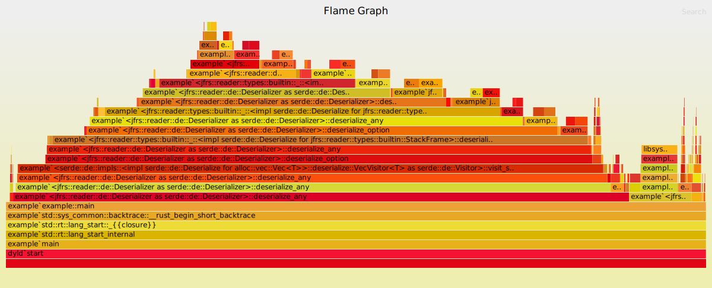
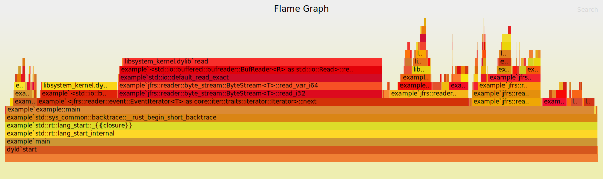
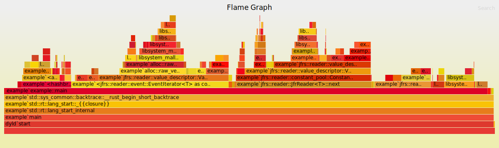
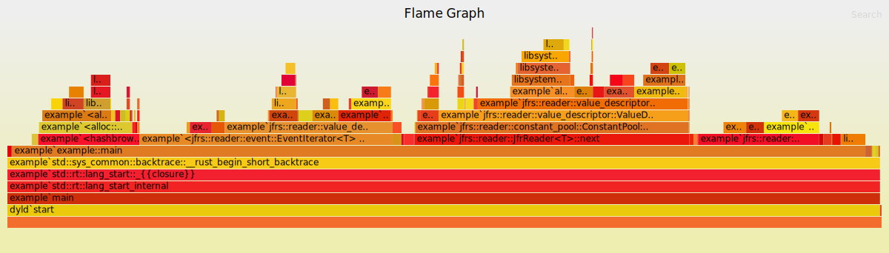
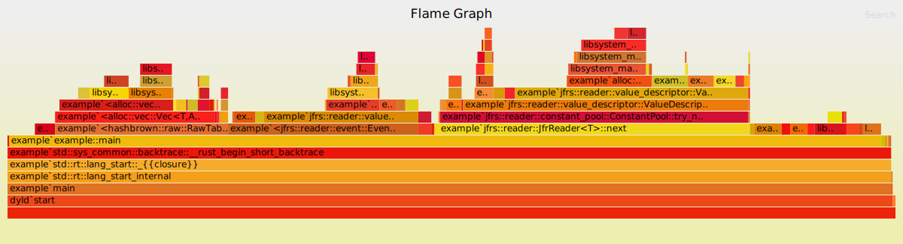

This is the recording of tuning attempts and performance notes about jfrs

## Environment
- MacBook Air (M2, 2022)
  * macOS Monterey 12.4
  * Memory: 24GB
  * Cores: 8
- JDK: Temurin-11.0.15+10
- Rust: 1.62.1

## Preparation

```
% cargo install flamegraph
```

### Measure Java performance as the baseline

```
% time java Example ~/develop/playground/jfr/test.jfr 10 > /dev/null
java Example ~/develop/playground/jfr/test.jfr 10 > /dev/null  2.47s user 0.18s system 239% cpu 1.110 total
```

## 1. Initial
commit: 9c698e8

```
% time target/release/example ~/develop/playground/jfr/test.jfr 10 > /dev/null
target/release/example ~/develop/playground/jfr/test.jfr 10 > /dev/null  26.29s user 1.62s system 99% cpu 28.099 total
```

- lol, x30 slower than Java implementation
- We can see that deserialization cost is the dominator
  * 
- Possible cause: Classes inside constant pool are always re-deserialized
  * So we should pre-deserialize for known types in constant pool

## 2. Changed to direct ValueDescriptor access
commit: 89d6b05

To implement pre-deserialization, many parts should be re-written.
Let's continue with changing to direct ValueDescriptor access for now, to see the max performance.

```
% time target/release/example ~/develop/playground/jfr/test.jfr 10 > /dev/null
target/release/example ~/develop/playground/jfr/test.jfr 10 > /dev/null  1.83s user 1.56s system 98% cpu 3.453 total
```

- Improved significantly, but still x3 slower than Java implementation
- This time, the dominant part is `read` from the underlying file.
  * 
- Maybe better to read whole bytes as byte array for each chunk?
  * This is what JDK's RecordingInput is doing: [RecordingInput.java](https://github.com/adoptium/jdk11u/blob/jdk-11.0.15%2B10/src/jdk.jfr/share/classes/jdk/jfr/internal/consumer/RecordingInput.java#L56)

## 3. Read full bytes in advance
commit: bcf447d

For now, let's continue with just reading all file bytes and create `Read` by `Cursor`.

```
% time target/release/example ~/develop/playground/jfr/test.jfr 10 > /dev/null
target/release/example ~/develop/playground/jfr/test.jfr 10 > /dev/null  1.20s user 0.08s system 99% cpu 1.289 total
```

- Performance is now much close to Java baseline (still bit slow though)
- Now we can see growing the vector is taking significant time
  * 
- I found that there are some places that creating vector without specifying capacity, though the size is known at the creation time.

## 4. Specify vector capacity to avoid resizing
commit: cf6f4c2

```
% time target/release/example ~/develop/playground/jfr/test.jfr 10 > /dev/null
target/release/example ~/develop/playground/jfr/test.jfr 10 > /dev/null  1.00s user 0.08s system 99% cpu 1.090 total
```

- Finally, performance is now same level as Java baseline
- We can see that memory alloc/free overhead are notable
  * 
- Can we improve further? Try arena-allocator or something?

## 5. Change hashing algorithm
commit: 45e56ad

Besides the allocation overhead, we can see that calculating hash consumes notable amount of time.

It's known that Rust's default hash algorithm is SipHash, which is robust against Hash DoS but it's not quite fast.

Obviously we don't have to care about DoS attack here so we can try more fast hash algorithm (https://github.com/rust-lang/rustc-hash) 

```
% time target/release/example ~/develop/playground/jfr/test.jfr 10 > /dev/null
target/release/example ~/develop/playground/jfr/test.jfr 10 > /dev/null  0.57s user 0.09s system 99% cpu 0.663 total
```

- Finally it outperformed Java
- Seems the allocation overhead is now more significant
  * 

TO BE CONTINUED
